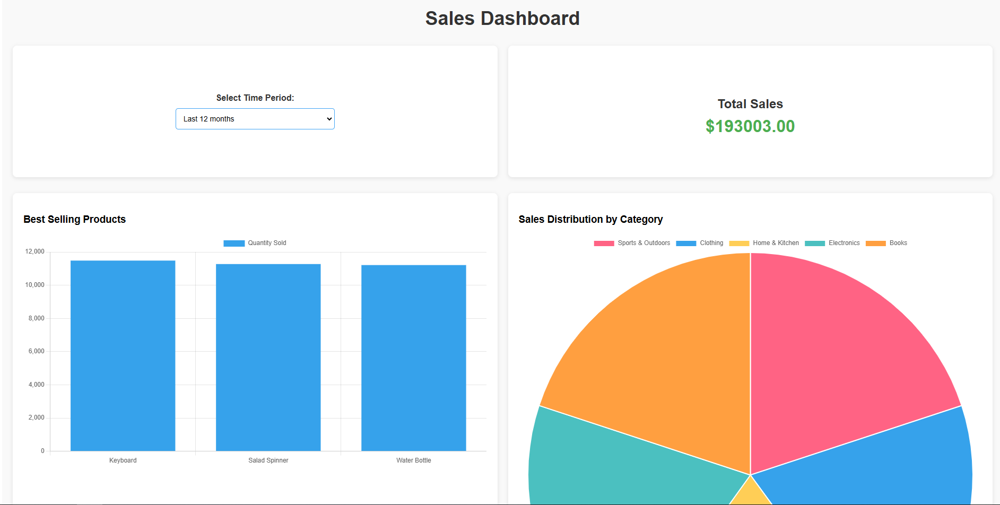
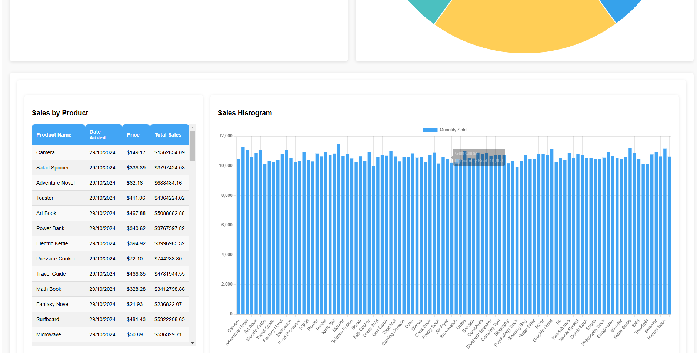

# Sales Dashboard Project Test Demo

This project includes both a frontend and a backend application to display key sales statistics, trends, and analytics. The frontend is built with Vue 3 and provides interactive visualizations, while the backend is a Node.js + TypeScript server that serves the data via RESTful APIs.




## FrontEnd Setup

1. Clone the repository and install dependencies
```sh
  git clone https://github.com/dmark1029/vue-test
  cd frontend
  npm install
```

2. Start the development server
```sh
  npm run dev
```

## Backend Setup (Node.js + Typescript)

Key Features

  1. REST Endpoints:

  GET /analytics/total_sales?period=7
  Returns the total sales amount for the selected period.

  GET /analytics/trending_products?period=7
  Returns a list of the top 3 selling products with details like product name, quantity sold, and total sales amount for the selected period.

  GET /analytics/category_sales?period=7
  Returns a breakdown of sales by category, including the number and percentage of sales for the selected period.

  GET /products?period=7
  Returns a list of products with their respective number of sales for the selected period.

  2. Database

  The backend uses MongoDB to store products and sales data.
  It parses the zip file and write data from the csv files to the database.
  And a database named test needs to be created first to import data from csv file to the db.

  You can update the data from products.csv and sales.csv in the data.zip file.

  1. Clone the repository and install dependencies
```sh
  git clone https://github.com/dmark1029/vue-test
  cd backend
  npm install
```

2. Start the development server
```sh
  npm run start
```


## API documentation
  
* GET https://localhost:5000/analytics/total_sales?period=7

Description: Returns the total sales for the selected period.
period: The time period for the sales data (e.g., last7days, last30days, last12months).
Response:
```JSON
{
  "totalSales": 85124
}
```

* GET https://localhost:5000/analytics/trending_products?period=7

Description: Returns the top 3 selling products that have the biggest quantity values.
period: The time period for the sales data (e.g., last7days, last30days, last12months).
Response:
```JSON
{
    "trendingProducts": [
        {
            "productID": 60,
            "productName": "Power Bank",
            "totalSales": 1272389.41,
            "totalQuantity": 5068
        },
        {
            "productID": 98,
            "productName": "Surfboard",
            "totalSales": 1243111.4,
            "totalQuantity": 5057
        },
        {
            "productID": 19,
            "productName": "Oven",
            "totalSales": 1333622.25,
            "totalQuantity": 5051
        }
    ]
}
```

* GET https://localhost:5000/analytics/category_sales?period=7

Description: Returns the percentage breakdown of sales by category.
period: The time period for the sales data (e.g., last7days, last30days, last12months).
Response:
```JSON
{
    "categorySales": [
        {
            "category": "Home & Kitchen",
            "totalQuantity": 93788,
            "totalSales": 23923540.71,
            "percentage": 20.089464002059692
        },
        {
            "category": "Sports & Outdoors",
            "totalQuantity": 92928,
            "totalSales": 23574656.340000004,
            "percentage": 19.796493154769244
        },
        {
            "category": "Books",
            "totalQuantity": 93664,
            "totalSales": 23790726.76,
            "percentage": 19.977935315740236
        },
        {
            "category": "Electronics",
            "totalQuantity": 94148,
            "totalSales": 23897339.57,
            "percentage": 20.067461955405165
        },
        {
            "category": "Clothing",
            "totalQuantity": 93466,
            "totalSales": 23898749.080000006,
            "percentage": 20.068645572025666
        }
    ]
}
```

* GET https://localhost:5000/products?period=365

Description: Returns a list of products with their sales information.
Response:
```JSON
{
    "products": [
        {
            "productID": 94,
            "productName": "Camping Tent",
            "category": "Sports & Outdoors",
            "price": 431.29,
            "totalQuantity": 10708,
            "totalSales": 4618253.32,
            "mostRecentSaleDate": "2024-10-29T00:00:00.000Z"
        },
        {
            "productID": 100,
            "productName": "Kayak",
            "category": "Sports & Outdoors",
            "price": 270.01,
            "totalQuantity": 10207,
            "totalSales": 2755992.07,
            "mostRecentSaleDate": "2024-10-29T00:00:00.000Z"
        },
        ...
    ]
}
```

Since there are no data for last 7 days and last 30 days, I added 6 months unit to show the difference and result clearly.
